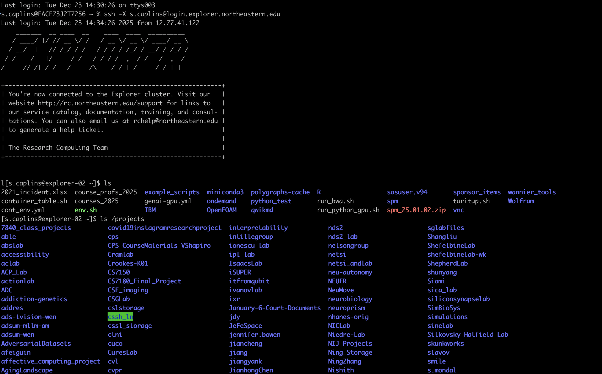
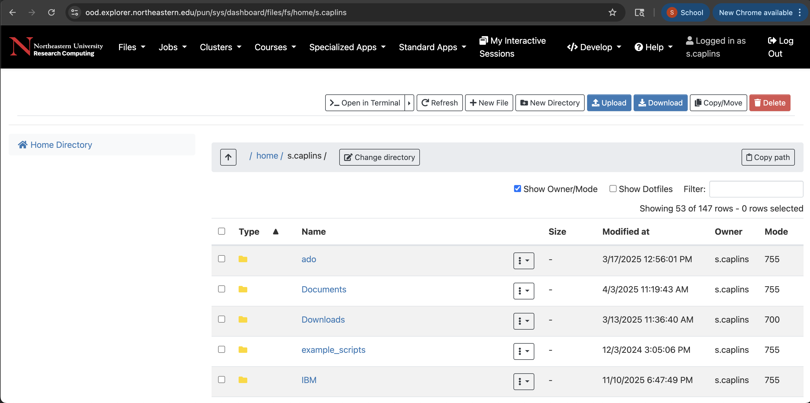
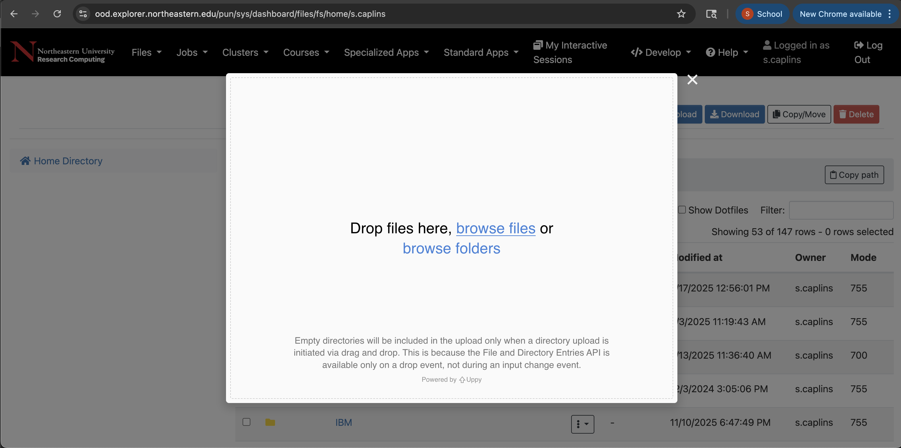
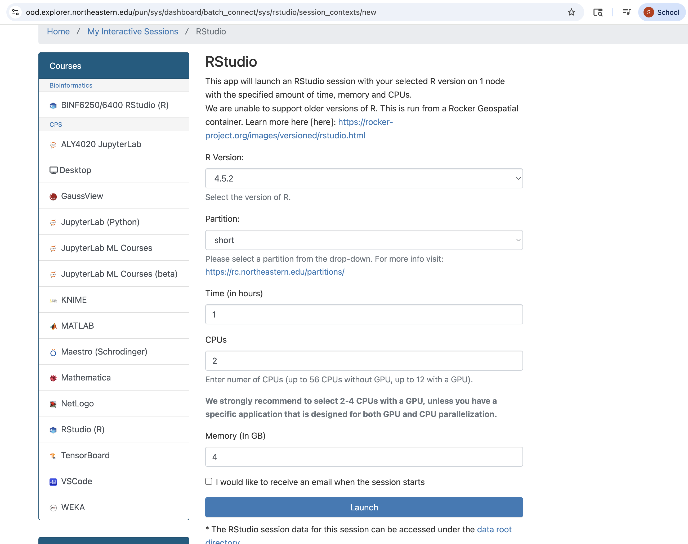
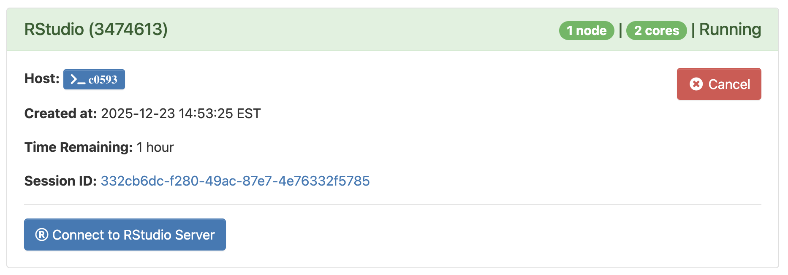

# Research Computing Training


## Presentor

Serena Caplins

Associate Bioinformatician

[Research Computing](https://rc.northeastern.edu/research-computing-team/)

## Introduction to Explorer and the OOD

Welcome to the Research Computing Spring 2026 training series. In this training we will be learning more about the Explorer cluster, what is it and how to use it. We also include an introduction to the Open OnDemand (OOD) website, which provides an interactive way to access Explorer.

Today this presentation will cover:

1. [What is an HPC](#what-is-an-HPC?)
2. [The Explorer cluster](#what-is-explorer)
3. [Logging in](#logging-in-via-the-terminal)
4. [File Paths](#welcome-to-file-paths)
5. [Transfering data](#transfering-data)
6. [Running jobs](#running-jobs)
7. [Software](#software)
8. [How to get help](#how-to-get-help)

## What is an HPC?

High-Performance Computing (HPC) refers to the practice of using a large cluster of computers together to solve complex problems that are beyond the capability of a single desktop computer.


Researchers and students can login to the HPC via a login node. On the login node work of low computational need can be performed (for example, editing files). When more computational power is needed the work needs to be moved to a compute node. We use the scheduler [SLURM](https://slurm.schedmd.com/documentation.html) (Simple Linux Utility for Resource Management) to manage researchers requests for compute nodes.

## What is Explorer?

Explorer is Northeastern's HPC system and is managed by the Research Computing team. Explorer supercedes the Discovery cluster. We have 45,000 CPU cores and over 525 GPUs available to all Northeastern faculty and students free of charge. The Explorer cluster is located at the [Massachusetts Green High Performance Computing Center](https://www.mghpcc.org/) (MGHPCC) in Holyoke, MA.


Explorer is connected to the university network over 10 Gbps Ethernet (GbE) for high-speed data transfer, and Explorer provides 6 PB of available storage on a high-performance file system. Compute nodes are connected with either 10 GbE or high data rate InfiniBand (200 Gbps or 100 Gbps), supporting all types and scales of computational workloads.

You can learn more about Explorer and the Research Computing team at our [Research Computing website](https://rc.northeastern.edu/) and in our [cluster usage documentation](https://rc-docs.northeastern.edu/en/latest/index.html) which has guides for logging in, running jobs, creating conda environments, using GPUs, and more!

## How to get an account on Explorer

The Explorer cluster supports research and coursework for all members of Northeastern University.

*For Research Accounts:*

We require all users of Explorer to have membership in a PI/Staff owned storage space. Storage is available free of charge up to 35 TB.

If your lab already has a storage space the PI can add you directly using our [project](https://rc-docs.northeastern.edu/en/latest/managingprojects/commands.html) command or you submit a request here in this [service now access form](https://bit.ly/NURC-AccessRequest).

If your lab does not yet have a storage space, one can be requested in the [storage request form](https://service.northeastern.edu/tech?id=sc_cat_item&sys_id=98ee4a2393c1da10b5e974f86cba10d9).

*For Classroom Accounts:*

You can apply for access via our [classroom access form]([https://bit.ly/NURC-Classroom](https://bit.ly/NURC-Classroom)). [Note the classroom access form can only be filled out by the instructor.] Please see our [documentation on classroom resources](https://rc-docs.northeastern.edu/en/latest/classroom/index.html) for more.

## How to access Explorer

There are two ways to work on the Explorer cluster:

A) The Terminal:


B) Or the Open OnDemand (OOD) website:


We will cover both throughout this presentation. More information can be found in our [documentation](https://rc-docs.northeastern.edu/en/latest/connectingtocluster/index.html) which also shows you how to setup password-less ssh.

### Logging in via the Terminal

---

#### On a MAC

On a mac you can use the Terminal.app that comes pre-installed. To find it search for terminal in the search option and select Terminal.app

Then enter the following (subsituting your own username):

```bash
ssh s.caplins@login.explorer.northeastern.edu
```

You will then be prompted to enter a password. Type your Northeastern password and press Enter. Note that the cursor does not move as you type your password. This is expected behavior.


#### On Windows

For Windows you will need to install a SSH client, such as Mobaxterm (which has some nice features) or Putty.

1. Open MobaXterm.

2. Click Session, then click SSH as the connection type.

3. In Remote Host, type login.explorer.northeastern.edu, make sure Port is set to 22, and click OK. (OPTIONAL: You can type your Northeastern username and password on MobaXterm, and it will save that information every time you sign in. If you opt to do this, you will be connected to Explorer after you click OK.)

4. At the prompt, type your Northeastern username and press Enter.

5. Type your Northeastern password and press Enter. Note that the cursor does not move as you type your password. This is expected behavior.

### Logging in via OOD

---
For the Open OnDemand website you navigate to this website:

<https://ood.explorer.northeastern.edu>

Where you will be prompted to enter your northeastern username and password and will be required to authenticate via DUO.

You will then see the OOD dashboard:


**You're now on the cluster!**

## Welcome to file paths

Now that you are on the cluster we should talk about files paths. You will learn more about these in our [Intro to Linux training session](https://rc.northeastern.edu/calendar_event/intro-to-linux/) (Feb 24th at 11 AM EST). but it's worth discussing a little now.

All users have read and write access to these spaces on the cluser:

`/home/username`
`/scratch/username`

If you are using the cluster for research, you will also have a space in:

`/projects/projectname`

If you are taking a course on the cluster you will have access to `/courses/coursename.code` and may not have access to `/projects`

When setting the path to these locations we recommend writing the full absolute file path, which means the path will always start with `/`. We'll have some examples of using files paths in the next session on transfering data.

Below is an example output of the command `ls` which we can use to list the contents of a directory.

In `/home` and `/projects`:



## Transfering Data

One of the first things you may need to do is transfer data or scripts to the cluster.

We should first consider the space limitations on the cluster before we transfer files.

Your `/home` directory is limited to 75 GBs.

Your `/scratch` directory is limited to 50 TB (but is purged on the first Tuesday each month, so not good for long-term storage).

Your `/projects` space is best for long-term storage of data or scripts that are large or contain many small files.

Your `/courses` directory (if you are taking a course on the cluster) can hold from 1-5 TB depending on what your instructor has requested. This space is shared among the whole class.

> Your quota can quickly reach capacity and you will then get an error message saying "quota exceeded". This can happen particulalriy quickly in `/home` as it has the smallest limit. Please see [our documentation](https://rc-docs.northeastern.edu/en/latest/best-practices/homequota.html) for tips to stay under the quota and what to do when you exceed it.

If you have many small files to transfer we recommend compressing them (via the commands `zip` or `tar`) prior to transfering them.

You can access the data from any path that you have the correct permissions to. Just remember for scripts it always best to write the absolute path which will begin with a `/` for example:

A path to a directory:
```bash
ls /projects/seedpod/rawdata
```

```result
bam_lists
bam_lists.tar.gz
Chr_genome_final_gene.gff3
feems
feems_grids
id.txt
metadata
nursery_samples.txt
outer_coordinates_spal.csv
population_files
spal
spal_barcodes.txt
spal_merged.txt
spal_only_barcodes.txt
sppa
sppa_barcodes.txt
sppa_barcode.txt
```

or a path to a specific file:

```bash
cat /home/s.caplins/myveryimportantscript.sh
```

```result
.~*~. Have a wonderful day! .~*~.
```

### Transfer a file on the terminal with `scp`

There are many many ways to transfer data to the cluster depending on where the data is currently hosted.

First example: files on your laptop or personal computer using the terminal command `scp`

Let's create a small test file to transfer to the cluster

```bash
echo "hello from the Explorer cluster" > testfile.txt
```

And then transfer it to the cluster with `scp`.

The command `scp` needs to know what you want to copy, and where you want to copy it.

In this example I am copying the file `testfile.txt` to my home directory via our transfer node (xfer.discovery.neu.edu).

```bash
scp testfile.txt s.caplins@xfer.discovery.neu.edu:/home/s.caplins
```

I can then login to the cluster and see if that file is present with the command `ls`

```bash
ssh s.caplins@login.explorer.northeastern.edu
ls
```
Suppose I wanted to put that in my projects space:

```bash
scp testfile.txt s.caplins@xfer.discovery.neu.edu:/projects/rc/s.caplins
```

### Transfer a file on the OOD with the files application

Login to the Open OnDemand website: <https://ood.explorer.northeastern.edu>


Navigate to the `Files` tab on the left-hand side. And select `Home Directory`


From the files application you are automatically put in your `/home` directory, but there is an option to change the directory if you want to put it in `/scratch` or `/projects`



If you select upload a popup window will open and you can choose to browse files or drop files there.



> The files application is limited to transferes of 10 GB. If you have larger files use scp or for very large files/datasets we recommend you use [Globus](https://rc-docs.northeastern.edu/en/latest/datamanagement/globus.html#using-globus)

And of course large datasets should be stored in `/projects` or for temporary storage `/scratch`.

You can also easily download any file from the cluster to your personal machine with the Files app. The Files app can also be used as an editor or to create new directories or files.

## Running Jobs

Now that you can transfer data to the cluster, let's discuss running jobs. So far we have used the login nodes and the xfer transer nodes, but to do larger computational tasks we should learn how to get on a compute node.


> Please don't run scientific software, transfer large files, or carry out computations on the login nodes. Login node traffic can acculate and slow down the whole system for all users.

### The commands `srun` and `sbatch`

When you're on the terminal you can use the command `srun`to access a compute node.

The command `srun` is a slurm command and it has several parameters that allow you to ask for specifc amounts of memory, time, and cpu-cores among other options.

There are also defaults set so you can quickly access a node when needed.

This is the most simple command that you can run to get a compute node from the terminal. **This can only be run from a login node.**

```bash
srun --pty bash
```

This command gets us the defaults: 4 hours, 1 node, 1 task (or thread/cpu core), 2 GB or memory, and 2 CPUs all on the short partition.

But there are other flags that we can use to request more time, cpus, or memory.

Here is an example asking for more of all of the parameters available:

```bash

srun --time=6:00:00 --mem=50GB --ntasks=16 --partition=short --pty bash
```

And the same command, but using the short form of all the flags. For example `-p` instead of `--partition`.

```bash
srun -t 6:00:00 --m 50GB --n 16 -p short --pty bash
```

One important option to learn in `srun` is the partition.

## Partitions (a brief detour)

A partition is a way for the Research Computing team to logically organize the nodes on the cluster and the resources that can be requested. Partitions usually vary by the amount of time that can be requested or by the number of nodes, and the type of resources (CPU or GPU).

On the Explorer cluster we have several partitions including:

| CPU      | GPU  |
| -----    | ---- |
| short (default)    | gpu  |
| sharing  | sharing |
|          | gpu-interactive |
|          | gpu-short |

| Need to apply for access |
|----|
| long |
|multigpu|

| Only available when taking a course |
|----|
| courses  |
| courses-gpu |

If you need access to long or multigpu you can [apply here]([https://bit.ly/NURC-PartitionAccess](https://bit.ly/NURC-PartitionAccess)). We just ask to see that you have optimized your code and are able to use those additional resources effectively.

See the [full list of partitions](https://rc.northeastern.edu/partitions/) and their limits on our website.

## Which Partition should I use?

If you are enrolled in a course on the cluster and have access to `/courses` directory then you should use the partitions *courses* for CPU jobs, and *courses-gpu* for GPU jobs. We have documentation and a [Courses CheatSheet](https://rc-docs.northeastern.edu/en/latest/classroom/cheatsheet.html) that has many commonly used slurm commands.

If you do not have access to `/courses` then you should use the short partition for most CPU jobs, and gpu-interactive or gpu-short for interactive GPU jobs. And then use the gpu partition for sbatch GPU jobs.

Here is an example of an interactive GPU job as requested via srun:

```bash
srun --partition=gpu-interactive --nodes=1 --gres=gpu:v100-sxm2:1 --cpus-per-task=2 --mem=10GB --time=02:00:00 --pty /bin/bash
```

## How to request GPU resources

What is a GPU?

A GPU (Graphics Processing Unit) is a specialized processor for parallel tasks, originally for rendering images, but now crucial for AI, gaming, and video, using thousands of cores to rapidly crunch data for complex visuals and deep learning, acting as a powerful helper to the CPU (Central Processing Unit).

Here's an `srun` command to request GPU resources in an interactive session.

```bash
srun --partition=gpu-interactive --gres=gpu:v100-sxm2:1 --ntasks=1 --mem=4GB --time=01:00:00 --nodes=1 --pty /bin/bash
```

You can also leave the `gres` flag general to the type of gpu. In the example below you will get whichever gpu type is first available. This is probably okay for quick testing. But for repeated runs of your code you should use the same gpu-type or at least record which gpu was used.

```bash
srun --partition=gpu-interactive --gres=gpu:1 --ntasks=1 --mem=4GB --time=01:00:00 --nodes=1 --pty /bin/bash
```

We have a [table on our website](https://rc.northeastern.edu/compute/) that lists the types of GPU that we have.

We will cover much more about GPUs and how to use them in our next training session! [Intro to GPUs on the Cluster](https://rc.northeastern.edu/calendar_event/intro-to-gpus-on-the-cluster/)

## Running interactive jobs in the OOD

On the Open OnDemand website interactive jobs are really streamlined and the process of submitting the job all takes place when you fill out the form for the type of job.

For example, for Rstudio we fill in the version we want, the partition, the time, cpus, and memory.



We can leave the options as they are and select `Launch`.
You will see the application move from `Queued` to `Starting` to `Running`.



The time you selected in the form starts when the application is running.

> Cancel applications when you are done with them as this free's up the node for another user!

## Running non-interactive jobs (sbatch)

These jobs are really the jobs doing most of the work on the cluster. They are meant to be setup and run without your supervision and just get the work done that you ask the cluster to do.

We recommend using an sbatch script once you have tested your commands in an srun session or via small sbatch scripts. Once you know your code will run and have some idea of how many resouces to request you are ready for an sbatch script.

>If you're not really sure how many resources you will need, we recommend asking for a little and scalling slowly up if needed (for example if your job ends due to not enough memory or cpu or time).

Heres an example sbatch script for CPU resources:
```bash
#!/bin/bash
#SBATCH -J MyJob                           
#SBATCH -p short                            
#SBATCH -N 1                                
#SBATCH -n 16                              
#SBATCH --mail-user=s.caplins@northeastern.edu  
#SBATCH --mail-type=ALL                    

# load required software

module load anaconda3/2024.06

source activate /home/s.caplins/.conda/envs/test

# run specific commands here

echo "You are doing great!"

python --version
```

You would save this file with the ending `.sh` and then run it on the cluster with the command `sbatch`:

```bash
sbatch myjob.sh
```
```result
Submitted batch job 3719393
```

You will see a number output which is the slurm job id. This id is usefull as it tracks information about your job as it runs on the cluster.

When slurm starts running your job it will output a slurm-jobid.out output file. This file contains all the information that was output when your job was running and if very useful to see if the job ran properly and if the expected output was obtained.

You can read the slurm-jobid.out in the files app or by using the command `less` in terminal:

```bash
cat slurm-3719393.out
```
```result
You are doing great!
Python 3.12.4
```
You can also use the command `less` to view and read files (even g.zipped files):

```bash
less slurm-3719393.out
```

Type `q` to quit less. There are many fun [shortcuts for less](https://man7.org/linux/man-pages/man1/less.1.html).

Now we'll learn how to check if our job is running.

## Checking job status

On the terminal we can run a few simple commands to check our queue. Of course substiture your own username.

```bash
squeue -u s.caplins
```

```result
             JOBID PARTITION     NAME     USER ST       TIME  NODES NODELIST(REASON)
           3718152     short ood-desk s.caplin  R      45:06      1 c0690
           3719477     short     bash s.caplin  R       0:59      1 c0690
```

 You can even check how busy a queue is, which is sometimes helpful if you notice it taking longer than normal for your job to run.

```bash
squeue -p short | wc -l
```

```result
518
```

By adding the `--start` flag to see when your job is predicted to start.

```bash
squeue -u s.caplins --start
```

On the OOD you can check running jobs via the tab labeled `My Interactive Sessions` or by the `Jobs` tab and selecting `Active Jobs`


From `My Interactive Sessions` you can also see some helpful information about your job, which we also saw in the `squeue -u username` output.


The information here can be helpful for debugging if something doesn't work as expected and can be given to the RC team if you run into an issue.

The name of the node that your job is running on is in the small blue box labeled `Host`.

The 7 digit number in parenthesis is the slurm job id number (3468842). This number can be used to queury slurm about your job.

If we click on the `Session ID: 1c0bc63a-8977-4810-85ac-afeffe2e1464` hyperlink we will see important files that are generated by the OOD when it runs your job. The file `output.log` can be particularily helpful to look at if the job doesn't run normally, and will be examined by the RC team if you create a ticket reporting an issue.

## How to become a super user

Now that you have seen how to run jobs, check their status, and check the slurm output. Its now worth learning how to evaluate how many computational resources your jobs have used. This can be extremely helpful for scaling up a project or analyses. 

We always recommend that when requesting resources (--mem, --cpu-per-tasks, --ntasks, etc) you request as close to the miminum required as possible. Of course if this is the first time you a running a program...you likely don't know exactly how many resources you will need. So it's best to start with few resources, close to the default and the scale up slowly. The more resources you ask for the longer your job will take to run as you wait for the resources to become available, and you don't want to wait if you don't have to. 

The command `seff slurmjobid` is very helpful here. 

`seff` stands for slurm efficiency and can be run on slurm jobs that have finished running. Here is an example output:

```bash
[s.caplins@explorer-01 ~]$ seff 371441
Job ID: 371441
Cluster: explorer
User/Group: s.caplins/users
State: COMPLETED (exit code 0)
Nodes: 1
Cores per node: 12
CPU Utilized: 00:17:14
CPU Efficiency: 8.29% of 03:27:48 core-walltime
Job Wall-clock time: 00:17:19
Memory Utilized: 5.22 GB
Memory Efficiency: 10.44% of 50.00 GB
```

This job could have requested fewer resources.

Here's one that is much better fit to the resources requested:

```bash
[s.caplins@explorer-01 ~]$ seff 2612438
Job ID: 2612438
Cluster: explorer
User/Group: s.caplins/users
State: COMPLETED (exit code 0)
Nodes: 1
Cores per node: 8
CPU Utilized: 02:54:02
CPU Efficiency: 83.83% of 03:27:36 core-walltime
Job Wall-clock time: 00:25:57
Memory Utilized: 569.19 MB
Memory Efficiency: 3.56% of 15.62 GB
```

Give `seff` a try on the next job you have that has finished running! Or after you have ended an interactive OOD session.

## Software

We have many software programs installed as modules. A module allows users to pick and choose which programs are available at what time. Thus you can have programs that fit different research needs.

> We recommend only loading modules when you need them as some can conflict with each other.

You can see which ones are available with the command:

```bash
module avail
```

You can load a module of your choosing with:

```bash
module load anaconda3/2024.06
```

Where you maintain the case that was output in `module avail`.

> We do not recommend loading modules automatically by adding the module load command to your .bashrc (A hidden file in your `/home`). As this can interfer with the OOD and it makes scientific reproducibility more challengening.

The Anaconda package manager can be used to create conda environments which can house many different types of scientific software and is not limited to python packages. We have guides on using [conda on Explorer](https://rc-docs.northeastern.edu/en/latest/software/packagemanagers/conda.html#conda) and we have several training videos for [classroom or reseach use of conda](https://rc.northeastern.edu/training/).

We also support [running containers on the cluster](https://rc-docs.northeastern.edu/en/latest/containers/index.html).

And installing [software from source code](https://rc-docs.northeastern.edu/en/latest/software/fromsource/index.html). 

## How to get help

Email the Research Computing team at [rchelp@northeastern.edu](mailto:rchelp@northeastern.edu).

Come to [office hours](https://rc.northeastern.edu/getting-help/) hosted on Zoom.

Or [book a consultation](https://rc.northeastern.edu/getting-help/) with an RC team member.

Review our [Documentation](https://rc-docs.northeastern.edu/en/latest/index.html).

Thank you!

---

*For questions or support, contact the Research Computing team at [rchelp@northeastern.edu](mailto:rchelp@northeastern.edu)*
