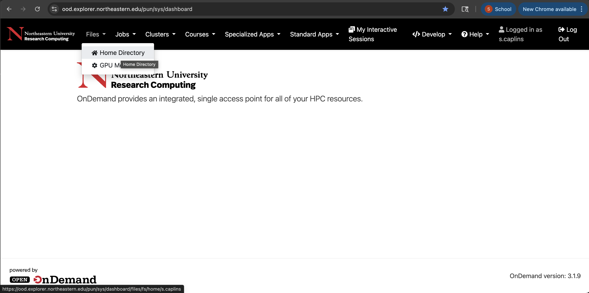

---

---
# Research Computing Training


## Introduction to Explorer and the OOD
Welcome to the Research Computing Spring 2026 training series. In this training we will be learning more about the Explorer cluster, what is it and how to use it. We also include an introduction to the Open OnDemand website, which provides an interactive way to access Explorer.

Today this presentation will cover:
1. What is an HPC
2. The Explorer cluster
3. Logging in
4. File Paths
5. Transfering data
6. Running jobs

## What is an HPC?

High-Performance Computing (HPC) refers to the practice of using a large cluster of computers together to solve complex problems that are beyond the capability of a single desktop computer.


Researchers and students can login to the HPC via a login node. On the login node work of low computational need can be performed (for example, editing files). When more computational power is needed the work needs to be moved to a compute node. We use the scheduler SLURM to manage researchers requests for compute nodes.

## What is Explorer?

Explorer is Northeastern's HPC system and is managed by Research Computing. Explorer supercedes the Discovery cluster. We have 45,000 CPU cores and over 525 GPUs available to all Northeastern faculty and students free of charge.

Explorer is connected to the university network over 10 Gbps Ethernet (GbE) for high-speed data transfer, and Explorer provides 6 PB of available storage on a high-performance file system. Compute nodes are connected with either 10 GbE or high data rate InfiniBand (200 Gbps or 100 Gbps), supporting all types and scales of computational workloads.

## How to get an account on Explorer

We require all users of Explorer to have membership in a PI/Staff owned storage space.

If your lab already has a storage space the PI can add you directly using our [project](https://rc-docs.northeastern.edu/en/latest/managingprojects/commands.html) command or you submit a request here in this [service now access form](https://bit.ly/NURC-AccessRequest).

If your lab does not yet have a storage space, one can be requested in the [storage request form](https://service.northeastern.edu/tech?id=sc_cat_item&sys_id=98ee4a2393c1da10b5e974f86cba10d9).


## How to access Explorer

There are two ways to work on the Explroer cluster:

A) The Terminal:


B) Or the Open on Demand website:


We will cover both throughout this presentation. More information can be found in our [documentation](https://rc-docs.northeastern.edu/en/latest/connectingtocluster/index.html) which also shows you how to setup password-less ssh.

### Logging in via the Terminal
---
#### On a MAC
On a mac you can use the Terminal.app that comes pre-installed. To find it search for terminal in the search option and select Terminal.app

Then enter the following (subsituting your own username):

```bash
ssh s.caplins@login.explorer.northeastern.edu
```


#### On Windows

For Windows you will need to install a SSH client, such as Mobaxterm (which has some nice features) or Putty.

1. Open MobaXterm.

2. Click Session, then click SSH as the connection type.

3. In Remote Host, type login.explorer.northeastern.edu, make sure Port is set to 22, and click OK. (OPTIONAL: You can type your Northeastern username and password on MobaXterm, and it will save that information every time you sign in. If you opt to do this, you will be connected to Explorer after you click OK.)

4. At the prompt, type your Northeastern username and press Enter.

5. Type your Northeastern password and press Enter. Note that the cursor does not move as you type your password. This is expected behavior.

### Logging in via OOD
---
For the Open OnDemand website you navigate to this website:

https://ood.explorer.northeastern.edu

Where you will be prompted to enter your northeastern username and password and will be required to authenticate via DUO.

You will then see the OOD dashboard:


You're now on the cluster!

## Welcome to file paths

Now that you are on the cluster we should talk about files paths. You will learn more about these in our Intro to Linux training session (Feb 24th at 11 AM EST). but it's worth discussing a little now.

All users have read and write access to three spaces on the cluser:

`/home`
`/scratch`
`/projects`

When setting the path to these locations we recommend writing the full absolute file path, which means the path will always start with `/`. We'll have some examples of using files paths in the next session on transfering data.

## Transfering Data

One of the first things you may need to do is transfer data or scripts to the cluster.

We should first consider the space limitations on the cluster before we transfer files.

Your `/home` directory is limited to 75 GBs.
Your `/scratch` directory is limited to 50 TB (but is purged each month, so not good for long-term storage).
Your `/projects` space is best for long-term storage of data or scripts that are large or contain many small files.

If you have many small files to transfer we recommend compressing them (via the commands `zip` or `tar`) prior to transfering them.

You can access the data from any path that you have the correct permissions to. Just remember for scripts it always best to write the absolute path which will begin with a `/` for example:

`/projects/seedpod/rawdata`

or

`/home/s.caplins/myveryimportantscript.sh`

### Transfer a file on the terminal with `scp`

There are many many ways to transfer data to the cluster depending on where the data is currently hosted.

First example: files on your laptop or personal computer using the terminal command `scp`

Let's create a small test file to transfer to the cluster

```bash
touch testfile.txt
echo "hello from the Explorer cluster" > testfile.txt
```
And then transfer it to the cluster with `scp`. 

The command `scp` needs to know what you want to copy, and where you want to copy it.

In this example I am coping the file `testfile.txt` to my home directory via our transfer node (xfer.discovery.neu.edu).

```bash
scp testfile.txt s.caplins@xfer.discovery.neu.edu/home/s.caplins
```

I can then login to the cluster and see if that file is present with the command `ls`

```bash
ssh s.caplins@login.explorer.northeastern.edu
```
### Transfer a file on the OOD with the files application

Login to the Open OnDemand website: https://ood.explorer.northeastern.edu


Navigate to the `Files` tab on the left-hand side. And select `Home Directory`



From the files application you are automatically put in your `/home` directory, but there is an option to change the directory if you want to put it in `/scratch` or `/projects`


If you select upload a popup window will open and you can choose to browse files or drop files there.


Note: the files application is limited to transferes of 10 GB. If you have larger files use scp or for very large files/datasets we recommend you use [Globus](https://rc-docs.northeastern.edu/en/latest/datamanagement/globus.html#using-globus)

And of course large datasets should be stored in `/projects` or for temporary storage `/scratch`

## Running Jobs

Now that you can transfer data to the cluster, let's discuss running jobs. So far we have used the login nodes and the xfer transer nodes, but to do larger computational tasks we should learn how to get on a compute node.

When you're on the terminal you can use the command `srun`to access a compute node.

The command `srun` is a slurm command and it has several parameters that allow you to ask for specifc amounts of memory, time, and cpu-cores among other options.

## Check job status

---

*For questions or support, contact the Research Computing team at [rchelp@northeastern.edu](mailto:rchelp@northeastern.edu)*